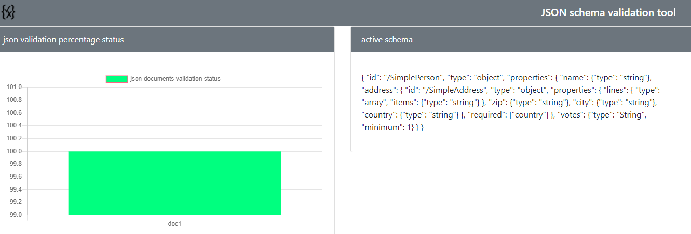
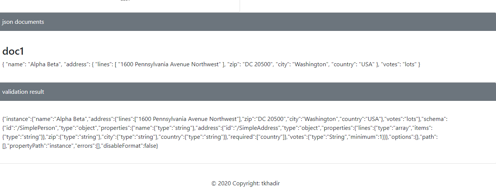

# json-validator-tool

my json validator tool is an idea that i had to monitor json schema in database here is an example for one document that is valid for 100% percent for example :



content of json and results validation is in bottom :



# how to start my tool

```
npm install
npm run start
```

# how to contribute ?

just fork and modify
